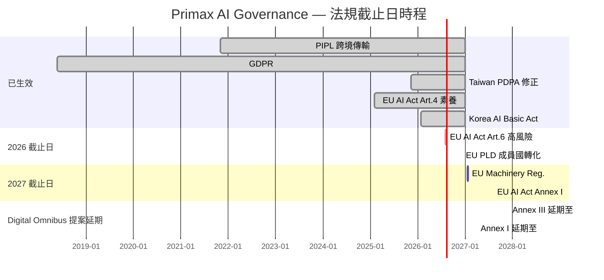
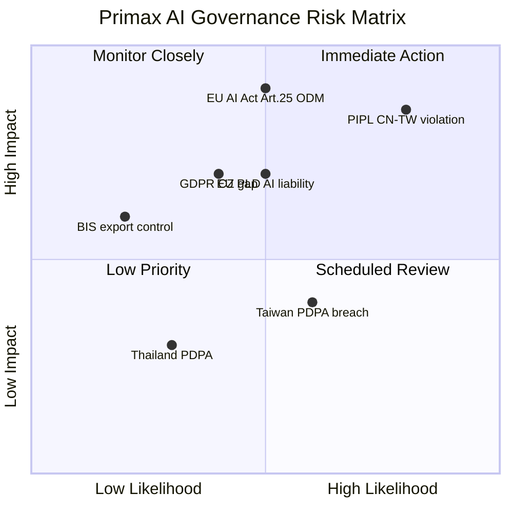

# AI 治理全球法規全景研究報告

**報告編號**: RR-2026-002
**日期**: 2026-03-02
**作者**: Glen Ho (DTO Intelligence System)
**分類**: Internal — Strategic Compliance Research
**狀態**: v1.0
**研究模式**: /critical-research（來源多元性 + 時效驗證 + 衝突呈現）
**前置報告**: CC-2026-001（合規基線）、RR-2026-001（Data Governance 能力建置）

### 相關報告快速連結
| 報告 | 用途 |
|------|------|
| **本報告（RR-2026-002）** | Phase A 全球法規全景研究 |
| [RR-2026-003 合規差距分析與路線圖](2026-03-02_ai-governance-compliance-roadmap.md) | Phase B 差距分析 + P0-P4 行動路線圖 |
| [RR-2026-004 AI 治理與資料治理建議報告](2026-03-02_ai-data-governance-recommendation-report.md) | 高管建議報告 |

---

## Executive Summary

本報告為 Primax Group（致伸集團）AI 治理綜合計畫的 Phase A 研究成果，系統性分析了 **7 項直接適用法規**、**7 項間接適用法規**、**11 項國際標準/框架**、以及 **6 項未來法規監控目標** 對 Primax 的影響。

### 核心發現

1. **EU AI Act 時程可能延後但不確定**：Digital Omnibus 提案（2025.11）建議將 Annex III 高風險系統義務延後至 2027.12.02，但仍在立法過程中。Primax 應以原始截止日（2026.08.02）為規劃基準。[VERIFIED: EC Digital Omnibus proposal]

2. **PIPL 跨境傳輸三條路徑已全部就緒**：認證途徑於 2026.01.01 正式生效（最後一塊拼圖），Primax 可從中選擇最適路徑。標準合同（SCC）對中小規模跨境傳輸最務實。[VERIFIED: CAC Measures 2025.10]

3. **Primax chatbot pilot 可能不屬於 EU AI Act 高風險**：企業內部使用的 AI 助手若不涉及 Annex III 列舉的高風險場景（如就業決策、生物辨識），通常歸類為有限風險或最小風險。但仍需遵守 Article 50 透明度要求。[VERIFIED: EU AI Act Art.6 + Annex III]

4. **ODM/EMS 產品若含 AI 安全元件，觸發 Article 25 義務**：Primax 作為 ODM 製造商，若客戶產品嵌入 AI 且屬於 Annex I 安全立法涵蓋範圍，Primax 可能被視為高風險 AI 系統的 provider。這是最高法律風險。[VERIFIED: EU AI Act Art.25]

5. **亞太隱私法規正加速 AI 治理整合**：台灣 PDPA 2025 修正設立 PDPC 但未納入 AI 專門條款；泰國 2026.02 發布 AI 資料保護指引草案；韓國 AI Basic Act 2026.01 生效；日本 2025.05 通過 AI 法。[VERIFIED: 多國立法追蹤]

6. **ISO 42001 非 EU AI Act 推定合規標準**：EU 另行開發 prEN 18286 作為推定合規的調和標準。但 ISO 42001 仍是全球最全面的 AI 管理系統認證框架，可作為治理基礎。[VERIFIED: CEN-CENELEC JTC21]

---

## 信號強度圖

```
信號強度（對 Primax 的影響程度 × 時間緊迫度）

[CRITICAL] ████████████████ EU AI Act Art.25 (ODM 產品 AI 義務)
[CRITICAL] ███████████████  PIPL 跨境傳輸 CN→TW (已生效)
[HIGH]     ██████████████   EU AI Act Art.50 透明度 (2026.08)
[HIGH]     █████████████    EU Product Liability Directive (2026.12)
[HIGH]     ████████████     Taiwan PDPA 通報義務 (已生效)
[MEDIUM]   ███████████      GDPR CZ 據點合規確認
[MEDIUM]   ██████████       Thailand PDPA + AI 指引 (2026)
[MEDIUM]   █████████        China AI 標準化 30+ 新標準
[LOW]      ████████         Korea AI Basic Act (2026.01)
[LOW]      ███████          ISO 42001 認證規劃
[MONITOR]  ██████           EU AI Liability Directive
[MONITOR]  █████            UK AI regulation evolution
```

---

## 1. EU AI Act — 製造業/ODM 適用性分析

### 1.1 Primax AI 系統風險分類評估

| AI 系統/用例 | 風險等級 | 分類依據 | 義務等級 | 截止日 |
|---|---|---|---|---|
| **AI Chatbot Pilot**（企業內部知識問答） | **有限風險** | 非 Annex III 場景；Art.50 透明度義務 | 告知使用者為 AI 互動 | 2026.08.02 |
| **War Room Dashboard**（營運 KPI 可視化） | **最小風險** | BI 工具，不含自主決策 AI | 自願採用行為準則 | N/A |
| **SAP PP RAG**（製造知識庫問答） | **有限風險** | 企業內部 AI 助手，Art.50 | 告知 + 記錄保存 | 2026.08.02 |
| **ODM 產品嵌入式 AI**（若有） | **可能高風險** | Annex I 安全立法 + Art.25 | 完整合規義務 | 2027.08.02 |
| **AI 視覺檢測**（若部署於產線） | **可能高風險** | 安全元件（Machinery Regulation） | CE 認證 + 技術文件 | 2027.08.02 |
| **員工 HR AI 工具**（若部署） | **高風險** | Annex III 第4項：就業領域 AI | 完整合規義務 | 2026.08.02 |

### 1.2 Article 25：產品製造商的 AI 義務

**核心規定** [VERIFIED: Art.25 原文]：
當高風險 AI 系統是 Annex I Section A 所列產品安全立法涵蓋的產品安全元件時，**產品製造商**在以下情況被視為高風險 AI 系統的 provider：
- (a) AI 系統以產品製造商的名稱或商標上市
- (b) AI 系統在產品上市後以製造商名稱投入使用

**對 Primax 的影響**：
- 作為 ODM/EMS，若客戶要求在產品中整合 AI 功能，且該產品受 Annex I 安全立法涵蓋（如 Machinery Regulation 2023/1230），Primax 可能承擔 provider 義務
- **關鍵問題** `[needs_legal_review]`：ODM 模式下，品牌商（客戶）還是製造商（Primax）承擔 Art.25 義務？取決於 AI 系統以誰的名義上市
- 建議：**立即盤點所有客戶產品中是否含 AI 元件**

### 1.3 Article 4：AI 素養義務（已生效）

自 2025.02.02 起，所有部署或使用 AI 系統的組織必須確保員工具備足夠的 AI 素養。Primax 的 digital_literacy 計畫可能部分覆蓋此要求，但需確認是否符合 Art.4 的具體標準。

### 1.4 Digital Omnibus 延期提案

**⚠ 衝突資訊 — 呈現給使用者判斷**

| 觀點 | 內容 | 來源 |
|---|---|---|
| **延期派** | Omnibus 提案將 Annex III 義務延後至 2027.12.02（long-stop），Annex I 延後至 2028.08.02 | EC Digital Omnibus (2025.11) |
| **維持派** | 提案仍在立法過程，EP + Council 未通過，可能被修改或否決 | IAPP 分析 (2025.12) |
| **務實建議** | 以原始截止日（2026.08.02）為規劃基準，Omnibus 通過後調整 | 多家律所一致建議 |

**本報告立場**：依照 Critical Research Protocol，不單方面裁決。但建議 Primax 以原始時程規劃，視 Omnibus 為潛在的緩衝期。

### 1.5 歐盟標準化延遲

歐盟委員會未能在 2026.02.02 截止日前發布高風險 AI 系統分類指南。CEN/CENELEC 的調和標準（含 prEN 18286 品質管理系統）預計 2026 年內發布，但在 OJEU 引用（正式推定合規效力）的時程仍不確定。

---

## 2. PIPL 跨境傳輸完整路徑分析

### 2.1 三條合規路徑比較

| 維度 | 安全評估 (Security Assessment) | 標準合同 (Standard Contract/SCC) | 認證 (Certification) |
|---|---|---|---|
| **適用場景** | CIIO、重要數據、>100 萬人 PI、>1 萬人 sensitive PI | 中小規模跨境傳輸 | 集團內多實體頻繁傳輸 |
| **主管機關** | CAC 直接審批 | 省級 CAC 備案 | 第三方認證機構 |
| **處理時程** | 最嚴格，數月至一年 | 備案 10 工作日提交，15 工作日審核 | 新制度，實際時程待觀察 |
| **法規基礎** | PIPL Art.38 + 專門辦法 | PIPL Art.38 + SCC 辦法（2023.06 生效） | PIPL Art.38 + 認證辦法（2026.01 生效） |
| **成本** | 高（需完整安全評估報告） | 中等（PIPIA + SCC 簽署 + 備案） | 中高（第三方認證費用） |
| **Primax 適用性** | 可能不需要（除非涉及 >100 萬人 PI 或重要數據） | **最推薦**：適合員工 + 營運資料跨境 | 長期可考慮：適合集團多實體 |

### 2.2 Primax CN→TW 路徑建議

**推薦路徑：標準合同（SCC）**

理由：
1. Primax CN 工廠傳輸至 TW 總部的資料主要為員工資料和營運資料，規模不太可能觸發安全評估門檻
2. SCC 為自主管理流程，備案週期可預測（10+15 工作日）
3. 成本和複雜度最低

**前置步驟**：
1. 完成個人資訊保護影響評估（PIPIA）— 需在備案前 3 個月內完成
2. 盤點 CN→TW 傳輸的資料類型和數量
3. 與 TW 總部（資料接收方）簽署標準合同
4. 向 CN 工廠所在地省級 CAC 提交備案

### 2.3 實際案例與執法動態

**首例備案通過**（2023.06）：北京一家線上數據服務商成為首個通過 SCC 備案的企業，資料接收方位於香港。[VERIFIED: Beijing CAC notice]

**首例跨境傳輸處罰**（2025.05）：上海公安機關對一家**跨國公司**處以行政處罰，原因是未經安全評估、未簽署標準合同、未取得認證即將用戶個人資訊傳輸至法國總部。這是中國首例公開披露的專門針對跨境傳輸違法的行政處罰。[VERIFIED: Shanghai enforcement case]

**⚠ 時效性標注**：PIPL 跨境傳輸執法力度在 2025-2026 年明顯升高，但具體案例和罰款金額的公開資訊仍然有限。建議每 3 個月重新評估執法趨勢。

### 2.4 認證途徑（新制度概要）

2025.10.14 CAC 與市場監管總局聯合發布《個人信息跨境傳輸認證辦法》，2026.01.01 生效。配套國家標準 GB/T 46068-2025 於 2026.03.01 生效。

認證途徑的優勢：對於**集團內多實體頻繁跨境傳輸**的場景，一次認證可涵蓋一系列處理活動，管理效率較高。Primax 若未來擴大跨境資料流（如 CN↔TW↔TH 多點傳輸），可考慮此路徑。

---

## 3. 亞太隱私法規矩陣

### 3.1 五國法規比較

| 維度 | TW PDPA | TH PDPA | SG PDPA | JP APPI | KR PIPA |
|---|---|---|---|---|---|
| **生效狀態** | 2025.11 修正施行 | 2022.06 全面施行 | 2012 施行，持續修正 | 2003 施行，2022 修正 | 2011 施行，2023 修正 |
| **AI 專門條款** | ❌ 未納入（明確缺失） | 🔄 2026.02 指引草案 | ✅ AI 治理框架 v3（2026 Agentic AI） | ✅ 2025.05 通過 AI 法 | ✅ AI Basic Act 2026.01 生效 |
| **自動化決策權利** | ❌ 未規定 | 🔄 指引草案中提及 | ✅ Advisory Guidelines 2024 | ✅ APPI 修正草案中 | ✅ PIPA 2023 修正明確規定 |
| **DPO 要求** | 政府機關必須 | 必須 | 必須 | 非強制 | 必須（特定條件） |
| **跨境傳輸機制** | 需當事人同意或等效保護 | 需充分保護措施 | 需等效保護或同意 | 需等效保護或同意 | 需等效保護或同意 |
| **違規通報** | ✅ 新設 PDPC 通報義務 | 72 小時（2023 規則） | 3 天（2024 修正） | 報告義務（2022 修正） | 72 小時 |
| **罰則上限** | NT$20K-200K/次 | THB 5M | SGD 1M 或 10% 營收 | JPY 1 億 | KRW 最高營收 3% |
| **Primax 據點** | ✅ 總部 | ✅ 工廠 | ❌ 間接 | ✅ 據點 | ❌ 間接 |

### 3.2 AI 治理專門立法比較

| 法規 | 模式 | 風險分級 | 對 Primax 的意義 |
|---|---|---|---|
| **Singapore Model AI Gov Framework** | 自願框架 × 3 版本 | 原則導向 | 參考價值高；與 OECD 對齊可互通 |
| **Korea AI Basic Act** | 法律（2026.01 生效） | 高影響 AI vs 一般 AI | 若有韓系客戶可能被要求遵循 |
| **Japan AI Act** | 法律（2025.05 通過） | 鼓勵自律，非處罰導向 | 若有日系客戶合作，需了解 |
| **Thailand AI Draft Guidelines** | 指引草案（2026.02） | 高風險 AI 定義中 | TH 工廠 AI 部署需關注 |
| **Taiwan** | 尚無 AI 專法 | N/A | PDPC 可能成為未來 AI 監管入口 |

### 3.3 交叉合規可行性

**核心發現**：亞太地區尚未有類似 EU AI Act 的強制性 AI 法規（韓國 AI Basic Act 最接近但仍較溫和）。然而，**隱私法規（PDPA/APPI/PIPA）正在成為 AI 治理的間接執法工具** — 透過要求 AI 系統的資料處理合規來間接約束 AI 治理。

**建議策略**：
- 以 GDPR + EU AI Act 為合規天花板
- 其他亞太法規通常為 GDPR 的子集
- Singapore 框架作為最佳實踐參考
- Korea/Japan 的 AI 法律仍以鼓勵為主，短期合規壓力較低

---

## 4. AI 治理標準框架比較

### 4.1 三大框架對照

| 維度 | ISO/IEC 42001:2023 | NIST AI RMF 1.0 | OECD AI Principles |
|---|---|---|---|
| **類型** | 可認證管理系統標準 | 自願性風險管理框架 | 國際政策原則 |
| **範圍** | AI 管理系統全生命週期 | AI 風險識別、評估、管理 | AI 倫理和治理高層原則 |
| **認證** | ✅ 第三方認證審計 | ❌ 無認證機制 | ❌ 無認證機制 |
| **與 EU AI Act 關係** | 非推定合規標準（EU 另行開發 prEN 18286） | 可映射至 EU AI Act 要求 | 被多國法規參照 |
| **製造業適用性** | 高（可整合進 ISO 9001 QMS） | 中等（需自行定制） | 低（需轉化為具體措施） |
| **實施成本** | 中高（12-18 個月 + 認證費） | 低中（自行採用） | 低（原則層面） |
| **Gartner 預測** | 70%+ 企業將在 2026 前採用 AI 治理標準 | — | — |

### 4.2 ISO 42001 vs EU AI Act 推定合規

**關鍵發現** [VERIFIED: CEN-CENELEC JTC21]：

- ISO 42001 **不是** EU AI Act 的推定合規標準
- EU AI Office 在 2024.05 確認 ISO 42001 與最終 AI Act 文本「未完全對齊」
- CEN-CENELEC JTC21 正在開發 **prEN 18286**（AI 品質管理系統用於 EU AI Act 法規目的）
- prEN 18286 於 2025.10-2026.01 進行公開諮詢
- 首批調和標準可能在 2026 年內發布，但 OJEU 引用（正式推定合規效力）時程不確定

**對 Primax 的建議**：
- ISO 42001 仍是最全面的 AI 管理系統認證，作為**內部治理基礎**極有價值
- 但不能替代 EU AI Act 的直接合規義務
- 建議路徑：ISO 42001 作為基礎框架 → 補充 EU AI Act 特定要求 → 未來可升級至 prEN 18286

### 4.3 整合映射可行性

```
ISO 27001 (已有？) → ISO 27701 (隱私) → ISO 42001 (AI 管理)
     ↓                                          ↓
ISO 9001 (品質管理) ────────────────────→ 整合管理系統 (IMS)
     ↓                                          ↓
IEC 62443 (OT 安全) ────────────────────→ AI + OT 安全治理
```

NIST AI RMF 的四大功能（Govern / Map / Measure / Manage）可直接映射至 ISO 42001 的 PDCA 循環，允許在單次整合評估中同時驗證多個框架的合規性。

---

## 5. Physical AI + OT 安全治理

### 5.1 製造業 AI 的特殊治理需求

| 場景 | AI 類型 | 安全風險 | 適用標準 | EU AI Act 分類 |
|---|---|---|---|---|
| **AI 視覺檢測** | 影像辨識 | 漏檢缺陷 → 產品安全 | IEC 62443 + Machinery Reg. | 可能高風險（安全元件） |
| **預測性維護** | 時序預測 | 誤判 → 設備故障 | IEC 62443 | 可能有限風險 |
| **機器人 + AI** | 自主控制 | 人機協作安全 | Machinery Reg. 2023/1230 | 高風險（Annex I） |
| **IIoT 數據分析** | 資料分析 | 資料完整性 | IEC 62443-4-2 | 通常最小風險 |
| **AI 排程優化** | 最佳化演算法 | 決策偏差 | ISO 42001 | 通常最小風險 |

### 5.2 IEC 62443 與 AI 的交集

IEC 62443 系列標準是工業自動化控制系統（IACS）的網路安全權威框架。隨著 AI 整合進 OT 環境：

- **IEC 62443-4-2** 支援新興技術（IoT、AI）的安全整合至工業自動化系統
- **IT/OT 融合挑戰**：AI 系統通常跨越 IT（模型訓練、雲端推論）和 OT（工廠現場部署），需要統一的安全治理
- **Primax 現況** `[INFERRED]`：作為精密電子製造商，Primax 的工廠應已有一定程度的 OT 安全實踐，但 AI 整合進 OT 的治理可能尚未建立

### 5.3 EU Machinery Regulation 2023/1230 與 AI

新版歐盟機械法規（取代 Machinery Directive 2006/42/EC）將於 **2027.01.20** 適用，其中：
- AI 系統被明確納入安全元件的定義
- 含 AI 的機械產品需進行 CE 合規性評估
- 與 EU AI Act Annex I Section A 交叉引用

**對 Primax 的影響** `[needs_legal_review]`：若 Primax 的 ODM 產品含有 AI 驅動的安全相關功能（如自主感測、自動停機），需同時滿足 Machinery Regulation 和 EU AI Act 的要求。

---

## 6. 全球 AI 監管趨勢預測（2026-2028）

### 6.1 已確定的未來法規

| 法規 | 管轄區 | 時程 | 影響評估 |
|---|---|---|---|
| **EU Product Liability Directive** | EU | 成員國轉化截止 2026.12.09 | AI 系統和軟體明確納入「產品」定義；Primax 可能受影響 |
| **EU AI Liability Directive** | EU | JURI 委員會 2026.01 投票，全會 2026.02 | 仍在立法中；將建立 AI 特定的舉證責任制度 |
| **EU Machinery Regulation** | EU | 2027.01.20 適用 | AI 作為安全元件的 CE 認證 |
| **Korea AI Basic Act** | KR | 2026.01.22 生效 | 風險導向；高影響 AI 的特殊義務 |
| **China 30+ AI/Data Standards** | CN | 2026 持續發布 | CN 工廠合規義務增加 |
| **Thailand AI Guidelines** | TH | 2026 草案，時程 TBD | TH 工廠 AI 部署指引 |

### 6.2 監管趨勢分析

**趨勢 1：法規碎片化 vs 收斂**
- 碎片化壓力：美國政策反覆（Biden EO → Trump 撤銷 → 新框架）；各國法規差異
- 收斂信號：OECD AI Principles 被廣泛引用；ISO 42001 提供共通語言；Singapore 框架與 EU/US 對齊

**趨勢 2：從資料保護到 AI 專門立法**
- 2020-2023：AI 治理依附於隱私法規（GDPR、PIPL）
- 2024-2026：AI 專門法規湧現（EU AI Act、Korea AI Basic Act、Japan AI Act）
- 2027+：預計更多國家跟進 AI 專門立法

**趨勢 3：製造業 AI 治理升溫**
- EU Machinery Regulation 將 AI 帶入產品安全監管
- WEF Physical AI governance 倡議聚焦製造業
- IEC 62443 + AI 整合成為熱門議題

**趨勢 4：美國政策不確定性**
- Trump 政府撤銷 Biden 的 AI Diffusion Rule（2025.05）
- BIS 對中國晶片出口政策轉向個案審查（2026.01）
- AI 出口管制焦點在硬體/晶片，而非 AI 模型使用
- Primax 使用 Anthropic Claude 的直接出口管制風險較低 `[INFERRED]`，但需關注客戶端供應鏈要求

### 6.3 Primax 應提前準備的事項

| 優先級 | 準備事項 | 理由 | 建議時程 |
|---|---|---|---|
| P0 | AI 系統全集團盤點 | 所有法規都以「你有什麼 AI 系統」為起點 | 2026 Q2 |
| P0 | PIPL 跨境傳輸機制啟動 | 已生效，執法力度上升 | 立即 |
| P1 | EU AI Act 風險分類評估 | 確認義務範圍 | 2026 Q2 |
| P1 | 供應鏈 AI 合規要求調查 | 了解客戶的合規期待 | 2026 Q2-Q3 |
| P2 | ISO 42001 gap analysis | 建立治理基礎 | 2026 Q3-Q4 |
| P2 | OT + AI 安全治理評估 | IEC 62443 與 AI 整合 | 2026 Q3-Q4 |
| P3 | EU Machinery Regulation 準備 | 2027.01 適用 | 2026 Q4 |

---

## 法規適用性矩陣：Primax 各據點 × 法規/標準

### 整合式適用性 Heatmap

```
          TW      CN      CZ      UK      TH      JP      US
          ──────  ──────  ──────  ──────  ──────  ──────  ──────
EU AI Act   —     —       ██████  ████░░   —      —       —
PIPL        ████░ ██████   —       —       —      —       —
GDPR        —      —      ██████   —       —      —       —
UK DPA      —      —       —      ██████   —      —       —
TW PDPA   ██████   —       —       —       —      —       —
TH PDPA     —      —       —       —     ██████   —       —
BIS EAR   ░░░░░░ ░░░░░░   —       —       —      —     ██████
PLD         —      —      ████░░   —       —      —       —
Mach.Reg    —      —      ████░░   —       —      —       —
JP APPI     —      —       —       —       —    ████░░    —
KR AI Act   —      —       —       —       —      —       —
ISO 42001 ████░░ ████░░  ████░░  ████░░  ████░░ ████░░  ████░░

██████ = 直接適用（直接義務）
████░░ = 間接/部分適用（接收方/供應鏈/自願）
░░░░░░ = 監控/潛在影響
—      = 不適用
```

> **使用說明**：此矩陣展示每項法規對 Primax 各據點的適用程度。深色代表直接法律義務，淺色代表間接影響或自願標準。ISO 42001 為全據點建議採用的治理框架。

### Tier 1: 直接適用

| 法規 | TW | CN | CZ | UK | TH | JP | US |
|---|---|---|---|---|---|---|---|
| **EU AI Act** | — | — | ✅ 直接 | ✅ 間接 | — | — | — |
| **PIPL** | 接收方 | ✅ 直接 | — | — | — | — | — |
| **GDPR** | — | — | ✅ 直接 | — | — | — | — |
| **UK DPA/GDPR** | — | — | — | ✅ 直接 | — | — | — |
| **Taiwan PDPA** | ✅ 直接 | — | — | — | — | — | — |
| **Thailand PDPA** | — | — | — | — | ✅ 直接 | — | — |
| **BIS Export Controls** | 間接 | 間接 | — | — | — | — | ✅ 源頭 |

### Tier 2: 間接適用 / 供應鏈

| 法規 | 適用條件 | 影響路徑 |
|---|---|---|
| **Japan APPI + AI Act** | 日系客戶合作 | 客戶合規要求傳遞 |
| **Korea PIPA + AI Basic Act** | 韓系客戶合作 | 客戶合規要求傳遞 |
| **Singapore PDPA + AI Framework** | SEA 客戶/據點 | 最佳實踐參考 |
| **US AI policy** | 美系客戶合作 | 客戶合規要求傳遞 |
| **Canada AIDA** | 北美客戶 | 仍在立法中 |
| **India DPDP Act** | 印度供應鏈 | 規則制定中 |
| **Brazil LGPD** | 拉美業務 | 已生效 |

### Tier 3: 標準/框架 適用性

| 標準 | 與 Primax 的關聯 | 建議採用時程 |
|---|---|---|
| **ISO 42001** | AI 管理系統認證；治理基礎 | 2026 Q3 gap analysis |
| **ISO 23894** | AI 風險管理方法論 | 與 42001 一起評估 |
| **NIST AI RMF** | US 客戶可能要求 | 可與 42001 整合評估 |
| **ISO 27001 + 27701** | 資安 + 隱私管理基礎 | 確認現有認證狀態 |
| **IEC 62443** | OT 安全；AI + OT 整合 | 2026 Q3-Q4 |
| **ISO 9001** | QMS 整合 AI 治理 | 利用現有 QMS 框架 |
| **prEN 18286** | EU AI Act 推定合規標準 | 追蹤發布進度 |
| **OECD AI Principles** | 多國法規共同基礎 | 作為原則層面參考 |

---

## 完整引用表

| # | 來源 | 類型 | Authority | Independence | 時效性 | URL |
|---|---|---|---|---|---|---|
| S01 | EU AI Act Article 25 原文 | 法規原文 | high | high | 有效（2024 通過） | https://artificialintelligenceact.eu/article/25/ |
| S02 | EU AI Act Annex III 原文 | 法規原文 | high | high | 有效 | https://artificialintelligenceact.eu/annex/3/ |
| S03 | EU AI Act Article 6 原文 | 法規原文 | high | high | 有效 | https://artificialintelligenceact.eu/article/6/ |
| S04 | IAPP: EC 錯過高風險系統指南截止日 | 專業媒體 | high | high | 2026.02 | https://iapp.org/news/a/european-commission-misses-deadline-for-ai-act-guidance-on-high-risk-systems |
| S05 | Orrick: EU AI Act 6 Steps | 律所指南 | high | medium | 2025.11 | https://www.orrick.com/en/Insights/2025/11/The-EU-AI-Act-6-Steps-to-Take-Before-2-August-2026 |
| S06 | Cooley: Digital Omnibus on AI | 律所分析 | high | medium | 2025.11 | https://www.cooley.com/news/insight/2025/2025-11-24-eu-ai-act-proposed-digital-omnibus-on-ai-will-impact-businesses-ai-compliance-roadmaps |
| S07 | DataGuard: EU AI Act Timeline | 合規平台 | medium | medium | 2025 | https://www.dataguard.com/eu-ai-act/timeline |
| S08 | Trilateral Research: AI Act Timeline | 研究機構 | medium | high | 2025 | https://trilateralresearch.com/responsible-ai/eu-ai-act-implementation-timeline-mapping-your-models-to-the-new-risk-tiers |
| S09 | Arnold & Porter: PIPL Cross-border Clarifications | 律所 | high | medium | 2025.11 | https://www.arnoldporter.com/en/perspectives/advisories/2025/11/china-issues-clarifications-cross-border-data-transfer-rules |
| S10 | Chambers: PIPL Cross-border Final Piece | 法律目錄 | high | high | 2025 | https://chambers.com/articles/the-final-piece-of-chinas-cross-border-personal-information-transfer-regulations |
| S11 | China Briefing: Cross-border Certification | 商業媒體 | medium | medium | 2025 | https://www.china-briefing.com/news/china-cross-border-data-transfer-certification/ |
| S12 | R&P China Lawyers: Certification Route | 律所 | high | medium | 2025 | https://www.rplawyers.com/china-finalizes-certification-route-for-cross-border-data-transfer/ |
| S13 | White & Case: China SCC | 律所 | high | medium | 2023 | https://www.whitecase.com/insight-alert/chinas-standard-contract-outbound-cross-border-transfer-personal-information-effect |
| S14 | Jones Day: Taiwan PDPA Amendment | 律所 | high | medium | 2025.12 | https://www.jonesday.com/en/insights/2025/12/taiwan-passes-major-amendments-to-the-personal-data-protection-act |
| S15 | IS-Law: Taiwan PDPA AI Governance | 台灣律所 | medium | medium | 2025 | https://www.is-law.com/en/brief-analysis-of-taiwans-pdpa-amendment/ |
| S16 | Stellex Law: Taiwan PDPA 2025 | 台灣律所 | medium | medium | 2025 | https://stellexlaw.com/en/taiwan-personal-data-protection-act-amendments-2025/ |
| S17 | FOSR Law: Thailand AI Regulation | 律所 | medium | medium | 2025 | https://fosrlaw.com/2025/ai-data-privacy-thailand-2025/ |
| S18 | IAPP: China Data/AI Governance 2026 | 專業媒體 | high | high | 2026.01 | https://iapp.org/news/a/notes-from-the-asia-pacific-region-strong-start-to-2026-for-china-s-data-ai-governance-landscape |
| S19 | White & Case: China AI Tracker | 律所 | high | medium | 持續更新 | https://www.whitecase.com/insight-our-thinking/ai-watch-global-regulatory-tracker-china |
| S20 | FPF: Korea AI Framework Act | 研究機構 | high | high | 2024 | https://fpf.org/blog/south-koreas-new-ai-framework-act-a-balancing-act-between-innovation-and-regulation/ |
| S21 | Nature: Korea PIPA Automated Decision | 學術期刊 | high | high | 2024 | https://www.nature.com/articles/s41599-024-03470-y |
| S22 | Singapore IMDA: Model AI Gov Framework | 政府機構 | high | medium | 2024 | https://www.imda.gov.sg/resources/press-releases-factsheets-and-speeches/press-releases/2024/public-consult-model-ai-governance-framework-genai |
| S23 | CSA: ISO 42001 + NIST AI RMF for EU AI Act | 產業聯盟 | medium | medium | 2025.01 | https://cloudsecurityalliance.org/blog/2025/01/29/how-can-iso-iec-42001-nist-ai-rmf-help-comply-with-the-eu-ai-act |
| S24 | RSI Security: NIST AI RMF & ISO 42001 Crosswalk | 顧問公司 | medium | medium | 2025 | https://blog.rsisecurity.com/nist-ai-risk-management-framework-iso-42001-crosswalk/ |
| S25 | StandardFusion: ISO 42001 vs NIST AI RMF | SaaS 平台 | medium | medium | 2025 | https://www.standardfusion.com/blog/key-differences-between-iso-42001-and-nist-ai-rmf |
| S26 | NIST: AI RMF to ISO 42001 Crosswalk | 政府機構 | high | high | 2024 | https://airc.nist.gov/docs/NIST_AI_RMF_to_ISO_IEC_42001_Crosswalk.pdf |
| S27 | IoT Security Institute: IEC 62443 Smart Mfg | 研究機構 | medium | high | 2025 | https://iotsecurityinstitute.com/iotsec/iot-security-institute-cyber-security-articles/204-iec-62443-in-action-cybersecurity-for-smart-manufacturing |
| S28 | EU Parliament: AI Liability Directive | 立法追蹤 | high | high | 持續更新 | https://www.europarl.europa.eu/legislative-train/theme-a-europe-fit-for-the-digital-age/file-ai-liability-directive |
| S29 | Goodwin: EU Product Liability AI | 律所 | high | medium | 2025.02 | https://www.goodwinlaw.com/en/insights/publications/2025/02/alerts-practices-aiml-eu-updates-its-product-liability-regime |
| S30 | CEN-CENELEC JTC21: AI Standards Overview | 標準機構 | high | high | 2025 | https://jtc21.eu/wp-content/uploads/2025/06/CEN-CENELEC-JTC21-AI-Standards-Complete-Detailed-Overview.pdf |
| S31 | EC: AI Act Standardisation | 政府機構 | high | high | 持續更新 | https://digital-strategy.ec.europa.eu/en/policies/ai-act-standardisation |
| S32 | Wiley: BIS Rescinds AI Diffusion Rule | 律所 | high | medium | 2025.05 | https://www.wiley.law/alert-BIS-Rescinds-AI-Diffusion-Rule |
| S33 | Mayer Brown: China AI Governance Action Plan | 律所 | high | medium | 2025.10 | https://www.mayerbrown.com/en/insights/publications/2025/10/artificial-intelligence-a-brave-new-world-china-formulates-new-ai-global--governance-action-plan-and-issues-draft-ethics-rules-and-ai-labelling-rules |
| S34 | IAPP: EU Digital Omnibus Analysis | 專業媒體 | high | high | 2025.12 | https://iapp.org/news/a/eu-digital-omnibus-analysis-of-key-changes |
| S35 | PwC: EU Digital Omnibus AI Relief | 顧問公司 | high | medium | 2025 | https://www.pwc.com/us/en/services/consulting/cybersecurity-risk-regulatory/library/tech-regulatory-policy-developments/eu-digital-omnibus.html |
| S36 | AMT Law: Japan APPI Amendments | 日本律所 | high | medium | 2025 | https://www.amt-law.com/en/insights/others/publication_0029311_en_001/ |
| S37 | Chambers: Japan AI 2025 | 法律目錄 | high | high | 2025 | https://practiceguides.chambers.com/practice-guides/artificial-intelligence-2025/japan |

### 來源多元性統計

| 來源類型 | 數量 | 佔比 |
|---|---|---|
| 法規原文/政府機構 | 8 | 22% |
| 律所分析 | 15 | 40% |
| 專業媒體/協會 | 6 | 16% |
| 研究機構/學術 | 4 | 11% |
| 顧問/產業 | 4 | 11% |
| **合計** | **37** | **100%** |

---

## 研究方法與限制

### 方法
- 遵循 /critical-research 協議：每個子題使用三方向查詢矩陣（合規路徑/失敗模式/學術獨立）
- 所有法規引用對照原文或權威翻譯
- 衝突資訊呈現給使用者，不單方面裁決（見 §1.4 Digital Omnibus）
- 時效性標注：AI 領域 6 個月內有效；產業統計 12 個月；法規框架 18-24 個月

### 限制
1. **法律意見邊界**：本報告為研究分析，不構成法律意見。標記為 `[needs_legal_review]` 的項目需外部法律顧問確認
2. **公司內部資訊缺失**：多項評估基於公開資訊推斷 Primax 的合規狀態，實際狀態需內部確認
3. **快速演變的法規環境**：特別是 EU Digital Omnibus 和中國 AI 標準化，本報告的部分結論可能在 3-6 個月內需要更新
4. **製造業 AI 治理案例不足**：全球範圍內，製造業 AI 治理的公開實踐案例仍然有限，多數指引來自科技業或金融業

---

## Mermaid 分析圖表

### 法規時程圖



### Primax AI 治理風險矩陣



---

*Generated by DTO Intelligence System — Phase A Research*
*Report ID: RR-2026-002*
*Next action: Phase B — 全面差距分析 + 合規路線圖*
*Temporal validity: Core findings valid until 2026-09 (6-month window for AI regulatory data)*
